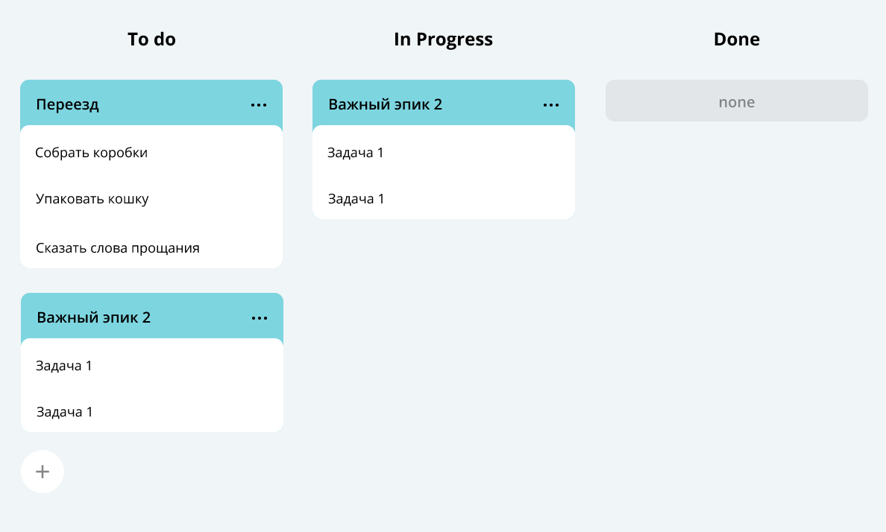

# java-kanban
Монолитное приложение, реализующее Kanban подход к управлению задачами. 
Содержит три типа задач (task, subtask и epic) и предоставляет 3 статуса для каждого из типов (new, in progress и done).
Задачей считается какое-либо конкретное действие: купить продукты, заплатить за интернет и т.д.
Эпик - большая задача, которая выполняется в несколько шагов - подзадач.

# Основная функциональность:

    Хранение данных в оперативной памяти, загрузка и сохранение данных в XML-файл
    Создание, получение, удаление, обновление, управление статусами всех типов задач
    Получение истории просмотров задач

# Для каждого вида задач предусмотрены следующие действия:

    Получение конкретной задачи по id
    Получение всех задач
    Добавление задачи
    Обновление задачи
    Удаление задачи по id
    Удаление всех задач
    Получение списка приоритетных задач по времени
    Получение истории из 10 последних просмотренных задач

# Tech Stack 🔧

# Java Core, JUnit 5, Gson, HttpServer, KVServer
# API Reference ⚙️

    GET tasks/ - получить список приоритетных задач

    GET tasks/history - получить историю из 10 последних просмотренных задач

    GET subtask/epic/{id} - получить список подзадач конкретного эпика

    GET tasks/task - получить список всех задач

    GET tasks/task/{id} - получить задачу по id

    POST tasks/task - создать задачу

    POST tasks/task/{id} - обновить задачу

    DELETE tasks/task - удалить все задачи

    DELETE tasks/task/{id} - удалить задачу по id *аналогичные эндпоинты для эпиков и подзадач

# How to start the project ▶️
1) Склонируйте репозиторий и перейдите в него
2) Запустите проект в выбранной IDE
3) Перейдите по адресу http://localhost:8080/tasks
4) Можно работать с проектом
